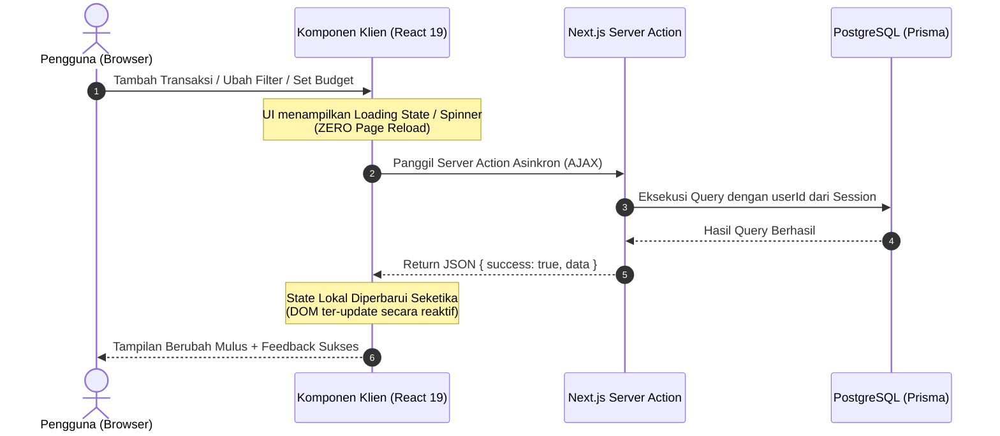

# Spesifikasi Teknis & Kontrak Integrasi Antarmodul

## DUITku Tracker — Fase 2 (AJAX & Budget Bulanan)

| Informasi | Keterangan |
|---|---|
| Penulis / PM | Muhammad Nauval Fadli |
| Target Pembaca | Akbar Mukti Wibowo, Muhammad Fikri, Muhammad Izzat, Muhammad Rofad Hamdani |
| Versi Dokumen | 1.0 |
| Tanggal | 30 September 2026 |

---

## 1. Pendahuluan & Prinsip Kontrak
Dokumen ini merupakan kontrak teknis resmi yang disepakati oleh seluruh programmer. Dengan adanya dokumen ini:
1. **Setiap programmer dapat langsung menulis kode secara paralel** tanpa harus menunggu rekan programmer lain selesai, karena nama fungsi, tipe parameter, dan format kembalian telah ditentukan secara presisi.
2. Komponen UI dapat dikembangkan menggunakan *mock data* yang mengikuti kontrak ini sebelum dihubungkan dengan API/Server Action asli.
3. Seluruh komunikasi data antar modul tunduk pada arsitektur asinkron (**AJAX/Zero-Reload**).

---

## 2. Kontrak Lapisan Data & Database (Milik Akbar)

### 2.1 Skema Prisma (`prisma/schema.prisma`)
Tambahkan model `Budget` dan perbarui relasi pada model `User`:

```prisma
model User {
  id           String        @id @default(cuid())
  email        String        @unique
  password     String
  name         String?
  createdAt    DateTime      @default(now())
  updatedAt    DateTime      @updatedAt
  transactions Transaction[]
  budgets      Budget[]      // <- Tambahkan relasi ini

  @@map("users")
}

model Budget {
  id        String   @id @default(cuid())
  userId    String   @map("user_id")
  user      User     @relation(fields: [userId], references: [id], onDelete: Cascade)
  month     Int      // Nilai 1 sampai 12 (Januari = 1, Desember = 12)
  year      Int      // Contoh: 2026
  amount    Decimal  @db.Decimal(12, 2)
  createdAt DateTime @default(now())
  updatedAt DateTime @updatedAt

  @@unique([userId, month, year])
  @@index([userId])
  @@map("budgets")
}
```

---

## 3. Tipe Data Bersama (TypeScript Definitions)

### 3.1 Tipe Budget (`src/types/budget.ts`)
```typescript
export interface Budget {
  id: string;
  userId: string;
  month: number; // 1 - 12
  year: number;  // misal: 2026
  amount: number;
  createdAt: Date;
  updatedAt: Date;
}

export interface SetBudgetInput {
  month: number;
  year: number;
  amount: number;
}

export interface BudgetProgress {
  month: number;
  year: number;
  budgetAmount: number;     // 0 jika belum ada budget
  totalExpense: number;     // Akumulasi pengeluaran aktual bulan tersebut
  remainingAmount: number;  // budgetAmount - totalExpense
  percentageUsed: number;   // (totalExpense / budgetAmount) * 100
  isOverBudget: boolean;    // true jika totalExpense > budgetAmount
  hasBudget: boolean;       // true jika pengguna telah menyetel budget
}

export type ActionResponse<T> =
  | { success: true; data: T; message?: string }
  | { success: false; errors: string[] };
```

### 3.2 Tipe Filter Transaksi (`src/types/index.ts`)
```typescript
export type FilterType = 'ALL' | 'INCOME' | 'EXPENSE';

export interface TransactionFilter {
  type?: FilterType;
  category?: string;
  month?: number; // 1 - 12
  year?: number;  // misal: 2026
  searchQuery?: string;
}
```

---

## 4. Kontrak Backend & Server Actions (Milik Akbar)

Semua Server Action bertempat di `src/lib/budget/actions.ts` dan `src/lib/transactions/actions.ts`. Identitas `userId` selalu diperoleh dari session server (`getAuthUser()`), bukan dari input klien.

### 4.1 Server Actions Budget (`src/lib/budget/actions.ts`)

#### 1. `setMonthlyBudgetAction`
- **Fungsi:** Menyimpan atau memperbarui budget bulanan pengguna.
- **Input:**
  ```typescript
  export async function setMonthlyBudgetAction(
    input: SetBudgetInput
  ): Promise<ActionResponse<Budget>>
  ```
- **Aturan Bisnis:**
  - `input.amount` harus berupa angka positif (> 0).
  - `input.month` harus bernilai antara 1 dan 12.
  - Melakukan operasi upsert pada database berdasarkan kombinasi `[userId, month, year]`.

#### 2. `getMonthlyBudgetProgressAction`
- **Fungsi:** Mengambil status progres budget pengguna untuk bulan dan tahun tertentu.
- **Input:**
  ```typescript
  export async function getMonthlyBudgetProgressAction(
    month: number,
    year: number
  ): Promise<ActionResponse<BudgetProgress>>
  ```
- **Kalkulasi Server:**
  - Ambil budget aktif untuk `userId`, `month`, `year`.
  - Hitung total transaksi pengeluaran (`type === 'EXPENSE'`) milik user pada rentang tanggal:
    `startDate = new Date(year, month - 1, 1)` sampai `endDate = new Date(year, month, 0, 23, 59, 59)`.
  - Kembalikan objek `BudgetProgress`. Jika belum ada budget, `hasBudget: false`, `budgetAmount: 0`, `percentageUsed: 0`.

#### 3. `deleteMonthlyBudgetAction`
- **Fungsi:** Menghapus data budget bulanan.
- **Input:**
  ```typescript
  export async function deleteMonthlyBudgetAction(
    budgetId: string
  ): Promise<ActionResponse<{ id: string }>>
  ```
- **Aturan Bisnis:** Verifikasi kepemilikan sebelum penghapusan (`budget.userId === session.userId`).

### 4.2 Server Actions Transaksi & Filter (`src/lib/transactions/actions.ts`)

#### `getFilteredTransactionsAction`
- **Fungsi:** Mengambil transaksi pengguna dengan filter dinamis.
- **Input:**
  ```typescript
  export async function getFilteredTransactionsAction(
    filter: TransactionFilter
  ): Promise<ActionResponse<TransactionItem[]>>
  ```

---

## 5. Kontrak Komponen Antarmuka Pengguna (UI Contracts)

### 5.1 Komponen UI Budget (Karya Izzat untuk Rofad)

#### 1. `BudgetCard` (`src/components/budget/BudgetCard.tsx`)
```typescript
export interface BudgetCardProps {
  progress: BudgetProgress | null;
  loading?: boolean;
  onOpenSetModal: () => void;
}
```
- **Tampilan:**
  - Menampilkan badge bulan (misal: "September 2026").
  - Menampilkan progress bar interaktif dengan indikator warna (Hijau, Kuning, Merah).
  - Tampilkan `Overbudget Alert` jika `progress.isOverBudget === true`.
  - Jika `progress?.hasBudget === false`, render Empty State dengan tombol "Tetapkan Anggaran".

#### 2. `BudgetModal` (`src/components/budget/BudgetModal.tsx`)
```typescript
export interface BudgetModalProps {
  isOpen: boolean;
  onClose: () => void;
  month: number;
  year: number;
  currentAmount?: number;
  onBudgetUpdated: () => void; // Callback AJAX untuk memicu refresh data di dashboard
}
```

### 5.2 Komponen Filter & Riwayat (Karya Fikri untuk Rofad)

#### `TransactionFilter` (`src/components/transactions/TransactionFilter.tsx`)
```typescript
export interface TransactionFilterProps {
  activeType: FilterType;
  selectedCategory?: string;
  searchQuery?: string;
  onFilterChange: (filters: {
    type: FilterType;
    category?: string;
    searchQuery?: string;
  }) => void;
  disabled?: boolean;
}
```
- **Perilaku:** Saat pengguna mengklik tab "Pemasukan", panggil `onFilterChange({ type: 'INCOME', ... })`. Tidak boleh ada reload halaman!

---

## 6. Standar Alur Kerja AJAX (Zero-Reload Architecture)

Seluruh komponen yang memerlukan komunikasi dengan server wajib mematuhi diagram alur AJAX berikut:



### Ketentuan Keras AJAX:
1. **DILARANG** menggunakan `window.location.reload()`, `router.refresh()` yang memicu blank flash, atau form standar `<form method="POST" action="...">` yang me-reload browser.
2. Gunakan `useTransition()` dari React 19 atau `useState(isPending)` untuk memberikan feedback loading yang mulus pada tombol.
3. Saat operasi transaksi (tambah/ubah/hapus) berhasil, fungsi *orchestrator* di dashboard wajib memutakhirkan 3 data sekaligus secara AJAX:
   - Daftar Transaksi
   - Ringkasan Keuangan (Saldo, Pemasukan, Pengeluaran)
   - Status Progres Budget Bulanan
