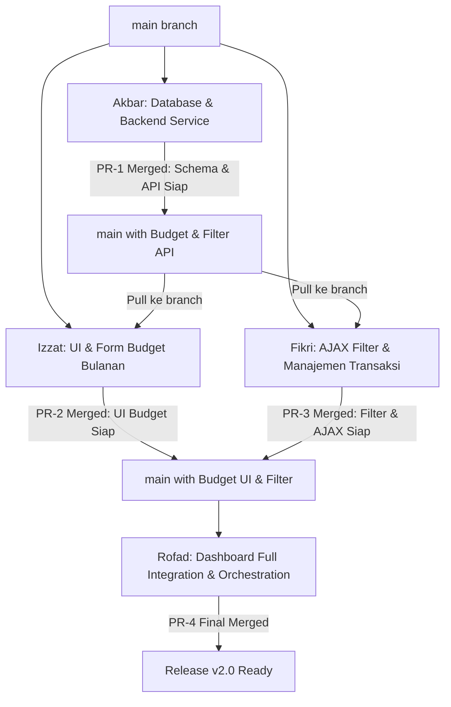

# Dokumen Pembagian Tugas & Rencana Kerja Tim (Work Breakdown Structure)

## DUITku Tracker — Fase 2 (Implementasi AJAX & Fitur Budget Bulanan)

| Informasi | Keterangan |
|---|---|
| Project Manager (PM) | Muhammad Nauval Fadli |
| Anggota Tim | Akbar Mukti Wibowo, Muhammad Fikri, Muhammad Izzat, Muhammad Rofad Hamdani |
| Versi Dokumen | 1.0 |
| Tanggal | 30 September 2026 |
| Target Rilis | Branch `main` terintegrasi penuh tanpa reload halaman |

---

## 1. Strategi Kolaborasi Git & Alur Kerja (Workflow)

### 1.1 Aturan Percabangan (Branching Strategy)
- Semua programmer **wajib membuat branch baru dari `main`** yang telah diperbarui (`git pull origin main`).
- Format penamaan branch: `feat/<nama_anggota>-<nama_fitur>`
- Dilarang keras melakukan `push` langsung ke branch `main`.
- Setiap fitur harus diselesaikan di branch masing-masing, diuji secara lokal, lalu diajukan melalui **Pull Request (PR)** ke `main` untuk direview dan di-merge oleh Project Manager (Nauval).

### 1.2 Urutan Integrasi & Penggabungan (Merge Order Strategy)
Agar proses pengerjaan paralel berjalan lancar dan minim hambatan dependensi:

1. **Tahap 1 (Fondasi Data & API):** Akbar menyelesaikan skema database, migrasi, types, dan service layer. (Merge PR #1).
2. **Tahap 2 (Pengembangan Fitur UI & Logic Paralel):**
   - Izzat mengerjakan komponen UI Budget Card, Progress bar, dan Modal pengaturan budget.
   - Fikri mengerjakan komponen Filter transaksi dan logika AJAX pada transaksi.
   *(Izzat dan Fikri dapat menggunakan mock interface yang telah didefinisikan di `docs/INTEGRATION_CONTRACT.md` sambil menunggu Akbar merge)*.
3. **Tahap 3 (Integrasi Penuh):** Rofad menggabungkan komponen Izzat, Fikri, dan backend Akbar ke dalam `src/app/(dashboard)/dashboard/`, mengorkestrasi state reaktif asinkron, dan memastikan zero-reload.

---

## 2. Rincian Tugas per Programmer

---

### Programmer 1: Akbar Mukti Wibowo
- **Peran:** Database Engineer & Backend Core Specialist
- **Branch:** `feat/akbar-budget-backend`
- **Tanggung Jawab:** Menyediakan lapisan data persisten untuk Budget Bulanan, query filter transaksi, dan penegakan isolasi pengguna di sisi server.

#### Batasan File Milik Akbar:
- `prisma/schema.prisma`
- `prisma/migrations/**`
- `src/types/budget.ts`
- `src/types/index.ts`
- `src/lib/budget/**` (`index.ts`, `actions.ts`, `validation.ts`)
- `src/lib/transactions/index.ts` (penambahan fungsi `getFilteredTransactions`)

#### Checklist Tugas:
- [ ] **Skema Database Prisma:**
  - [ ] Tambahkan model `Budget` ke `prisma/schema.prisma` dengan field: `id`, `userId`, `month` (Int), `year` (Int), `amount` (Decimal 12,2), `createdAt`, `updatedAt`.
  - [ ] Tambahkan relasi `budgets Budget[]` pada model `User`.
  - [ ] Tambahkan atribut `@@unique([userId, month, year])` dan `@@index([userId])`.
  - [ ] Jalankan migrasi: `npx prisma migrate dev --name add_budget_model`.
  - [ ] Jalankan `npx prisma generate`.
- [ ] **Type Definitions:**
  - [ ] Buat file `src/types/budget.ts` yang mengekspor interface `Budget`, `SetBudgetInput`, `BudgetProgress`, dan `BudgetSummary`.
  - [ ] Update `src/types/index.ts` untuk mengekspor tipe-tipe budget dan `TransactionFilter`.
- [ ] **Service Layer Budget (`src/lib/budget/index.ts`):**
  - [ ] Implementasi `setMonthlyBudget(userId, input)`: Melakukan upsert (create or update) data budget untuk user, bulan, dan tahun terkait.
  - [ ] Implementasi `getMonthlyBudget(userId, month, year)`: Mengambil budget aktif untuk bulan & tahun tertentu.
  - [ ] Implementasi `deleteMonthlyBudget(userId, budgetId)`: Menghapus budget dengan validasi kepemilikan (`budget.userId === userId`).
  - [ ] Implementasi `getMonthlyBudgetProgress(userId, month, year)`:
    - Menghitung total pengeluaran aktual pengguna pada rentang tanggal 1 s/d akhir bulan terkait (`type: 'EXPENSE'`).
    - Menghitung sisa anggaran (`budgetAmount - totalExpense`).
    - Menghitung persentase pemakaian (`(totalExpense / budgetAmount) * 100`).
    - Menentukan status boolean `isOverBudget` jika totalExpense > budgetAmount.
- [ ] **Service Filter Transaksi (`src/lib/transactions/index.ts`):**
  - [ ] Implementasi `getFilteredTransactions(userId, filter)`: Mengambil transaksi milik pengguna dengan filter dinamis (tipe `INCOME`/`EXPENSE`, kategori, bulan & tahun dari field `date`).
- [ ] **Server Actions (`src/lib/budget/actions.ts`):**
  - [ ] Buat wrapper Server Actions dengan `'use server'` dan validasi otentikasi menggunakan `getSession()` / `getAuthUser()`.
  - [ ] Tangani error dan kembalikan response seragam: `{ success: true, data }` atau `{ success: false, errors: string[] }`.

---

### Programmer 2: Muhammad Fikri
- **Peran:** AJAX & Transaction Flow Specialist
- **Branch:** `feat/fikri-ajax-filter-transactions`
- **Tanggung Jawab:** Menjamin seluruh manajemen transaksi dan filter riwayat berjalan 100% secara AJAX tanpa reload halaman peramban.

#### Batasan File Milik Fikri:
- `src/components/transactions/TransactionFilter.tsx`
- `src/components/transactions/useTransactionAjax.ts` (atau custom hook pendukung)
- `src/components/transactions/TransactionHistoryList.tsx`
- `src/lib/transactions/actions.ts` (menambahkan Server Action filter)

#### Checklist Tugas:
- [ ] **Komponen Filter Transaksi (`src/components/transactions/TransactionFilter.tsx`):**
  - [ ] Buat kontrol seleksi jenis transaksi: Tab / Radio pill untuk "Semua", "Pemasukan", "Pengeluaran".
  - [ ] Buat input pencarian teks / dropdown kategori (opsional).
  - [ ] Tambahkan trigger event `onFilterChange(newFilter)` yang dipanggil saat filter berubah.
  - [ ] Pastikan style komponen sesuai dengan design system ungu DUITku.
- [ ] **AJAX Controller / Custom Hook (`src/components/transactions/useTransactionAjax.ts`):**
  - [ ] Kelola state lokal: `transactions`, `loading`, `error`, `activeFilter`.
  - [ ] Buat fungsi `handleFilterChange(filter)` yang memanggil server action secara asinkron (AJAX) dan memperbarui `transactions` seketika.
  - [ ] Buat handler `handleAddTransaction(data)` yang mengirim data form ke server dan menambahkan item baru ke state list tanpa reload halaman.
  - [ ] Buat handler `handleUpdateTransaction(data)` yang memperbarui item di state list secara langsung.
  - [ ] Buat handler `handleDeleteTransaction(id)` yang menghapus item dari state list secara langsung.
- [ ] **Loading & Transition Feedback:**
  - [ ] Tampilkan skeleton loader atau spinner halus saat filter sedang berganti data.
  - [ ] Hindari pemanggilan `window.location.reload()` atau navigasi full browser pada seluruh aksi CRUD transaksi.
- [ ] **Server Action Filter (`src/lib/transactions/actions.ts`):**
  - [ ] Tambahkan `getFilteredTransactionsAction(filter)` yang memanggil service layer milik Akbar.

---

### Programmer 3: Muhammad Izzat
- **Peran:** Budget UI & Data Visualization Specialist
- **Branch:** `feat/izzat-budget-ui`
- **Tanggung Jawab:** Membangun seluruh antarmuka dan interaktivitas visual fitur Budget Bulanan (Budget Card, Progress Bar, Form & Modal Pengaturan Anggaran).

#### Batasan File Milik Izzat:
- `src/components/budget/BudgetCard.tsx`
- `src/components/budget/BudgetProgress.tsx`
- `src/components/budget/BudgetForm.tsx`
- `src/components/budget/BudgetModal.tsx`
- `src/components/budget/types.ts`
- `src/components/budget/adapters.ts`

#### Checklist Tugas:
- [ ] **Komponen Visual Budget Card (`src/components/budget/BudgetCard.tsx`):**
  - [ ] Tampilkan judul "Anggaran Bulanan" beserta label bulan & tahun aktif.
  - [ ] Tampilkan 3 metrik utama: Nominal Budget, Pengeluaran Aktual, dan Sisa Anggaran (atau Defisit).
  - [ ] Tampilkan persentase penggunaan (misal: `65% terpakai`).
  - [ ] Sediakan tombol interaktif: "Atur Anggaran" (jika belum ada) atau "Ubah Anggaran" (jika sudah ada).
- [ ] **Komponen Progress Bar (`src/components/budget/BudgetProgress.tsx`):**
  - [ ] Implementasikan progress bar dengan animasi transisi lebar (`transition-all duration-500`).
  - [ ] Warna dinamis:
    - **Hijau (`bg-emerald-500`):** Penggunaan < 80% (Kondisi aman).
    - **Kuning/Amber (`bg-amber-500`):** Penggunaan 80% – 100% (Mendekati batas limit).
    - **Merah (`bg-rose-500`):** Penggunaan > 100% (Overbudget).
  - [ ] Banner peringatan Overbudget otomatis muncul jika pengeluaran melebihi anggaran.
- [ ] **Empty State Budget:**
  - [ ] Jika user belum mengatur budget di bulan tersebut, tampilkan pesan informatif: *"Anda belum menetapkan anggaran untuk bulan ini"*.
  - [ ] Tombol CTA: *"Tetapkan Anggaran Sekarang"*.
- [ ] **Modal & Form Budget (`src/components/budget/BudgetModal.tsx` & `BudgetForm.tsx`):**
  - [ ] Input nominal budget dengan format Rupiah yang ramah pengguna.
  - [ ] Pemilihan bulan (Januari – Desember) dan tahun (misal: 2026).
  - [ ] Validasi: Nominal wajib diisi dan harus bernilai lebih besar dari 0 (`amount > 0`).
  - [ ] Tombol simpan dengan loading spinner (`isSubmitting`) yang mencegah dobel submit.
  - [ ] Tombol opsi hapus / reset budget jika sedang dalam mode edit, dilengkapi konfirmasi.
  - [ ] Pengiriman data form dieksekusi secara asinkron (AJAX) dan memanggil callback `onSuccess()`.

---

### Programmer 4: Muhammad Rofad Hamdani
- **Peran:** Dashboard Integration & AJAX Orchestrator Specialist
- **Branch:** `feat/rofad-dashboard-ajax-integration`
- **Tanggung Jawab:** Menggabungkan seluruh modul menjadi satu kesatuan halaman dashboard yang hidup, dinamis, tanpa data mock, dan beroperasi penuh secara AJAX.

#### Batasan File Milik Rofad:
- `src/app/(dashboard)/dashboard/page.tsx`
- `src/app/(dashboard)/dashboard/DashboardClient.tsx`
- `src/components/dashboard/SummaryCards.tsx` (modifikasi/adaptasi jika perlu)
- `src/components/dashboard/EmptyState.tsx` (modifikasi/adaptasi jika perlu)
- `src/components/dashboard/calculateSummary.ts`

#### Checklist Tugas:
- [ ] **Hapus Data Mock Statis:**
  - [ ] Bersihkan `previewTransactions` hardcoded dari `src/app/(dashboard)/dashboard/page.tsx`.
  - [ ] Pastikan halaman dashboard mengambil data awal secara aman dari server atau via AJAX fetch di sisi klien.
- [ ] **Pembuatan Orchestrator Client (`DashboardClient.tsx`):**
  - [ ] Simpan state reaktif terpadu: `selectedMonth`, `selectedYear`, `summaryData`, `budgetData`, `transactionsList`.
  - [ ] Buat kontrol pemilihan periode bulan/tahun di header dashboard.
- [ ] **Pemasangan Komponen Antarmuka:**
  - [ ] Pasang `SummaryCards` di bagian atas dashboard (Saldo, Pemasukan, Pengeluaran).
  - [ ] Pasang widget `BudgetCard` (karya Izzat) di samping atau di bawah ringkasan keuangan.
  - [ ] Pasang tombol / modal `TransactionForm` untuk tambah transaksi.
  - [ ] Pasang `TransactionFilter` (karya Fikri) tepat sebelum daftar riwayat.
  - [ ] Pasang `TransactionHistory` dengan tombol ubah dan hapus.
- [ ] **Orkestrasi Reaktif Asinkron (Sinkronisasi AJAX Lintas Komponen):**
  - [ ] Ketika transaksi baru berhasil ditambah:
    - Daftar transaksi langsung bertambah.
    - `SummaryCards` langsung memperbarui Saldo & Pengeluaran.
    - Progres pada `BudgetCard` langsung menyesuaikan pengeluaran aktual yang baru secara instan.
  - [ ] Ketika transaksi dihapus/diubah:
    - Seluruh metrik (Summary dan Budget) ikut ter-revalidasi seketika tanpa refresh browser.
  - [ ] Ketika periode bulan/tahun diganti di filter:
    - Data Budget dan daftar transaksi langsung menyesuaikan periode tersebut secara AJAX.
- [ ] **Uji Responsivitas & Tema:**
  - [ ] Pastikan tampilan rapi di mobile (`width < 640px`) dan desktop.
  - [ ] Uji kompatibilitas dengan dark mode dan light mode via cookie tema.

---

## 3. Konvensi Commit & Standar Pull Request

### Format Pesan Commit:
Gunakan standar *Conventional Commits*:
- `feat(akbar): implement budget prisma model and migration`
- `feat(akbar): add getMonthlyBudgetProgress server service`
- `feat(fikri): create TransactionFilter component with type pills`
- `feat(fikri): implement ajax handler for transaction crud without reload`
- `feat(izzat): add BudgetCard and dynamic progress bar`
- `feat(izzat): implement BudgetModal and validation form`
- `feat(rofad): integrate budget card and ajax transactions into dashboard`
- `fix(nama): resolve edge case in percentage calculation`

### Checklist Sebelum Membuka Pull Request (PR):
1. Telah menjalankan `npm run build` dan **lolos tanpa error TypeScript**.
2. Telah menjalankan `npm run lint` dan lolos tanpa error ESLint.
3. Tidak mengubah file di luar direktori wewenang masing-masing.
4. Menuliskan ringkasan perubahan dan menyertakan bukti screenshot / video rekaman aksi AJAX pada deskripsi PR.
